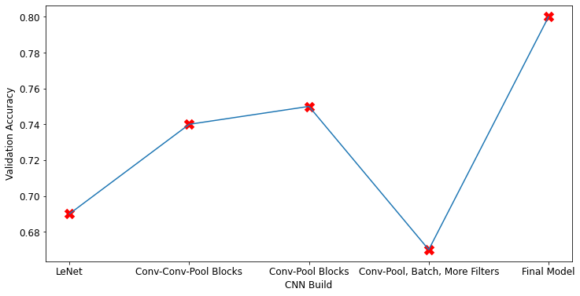
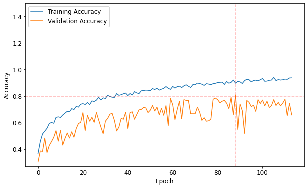
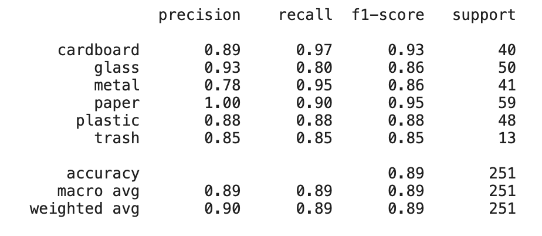
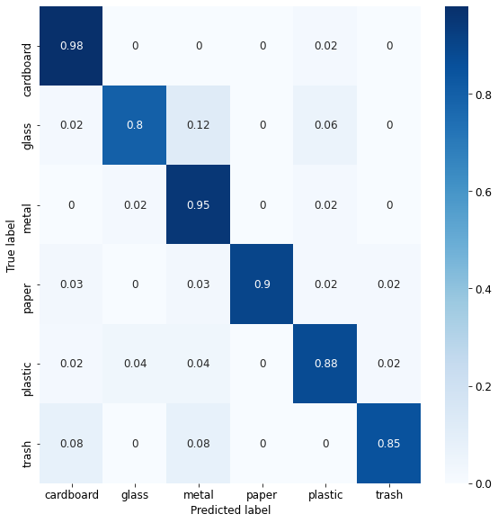
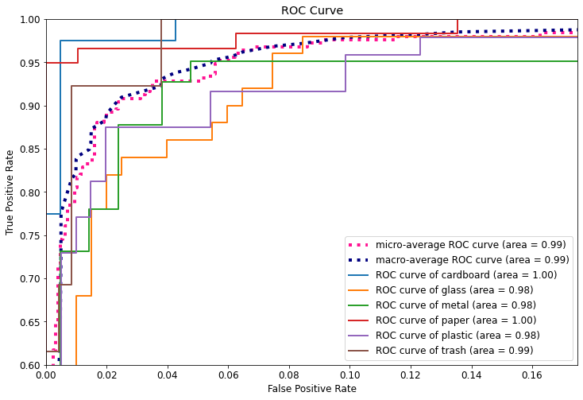
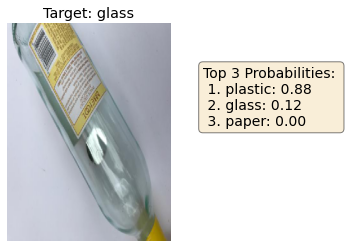
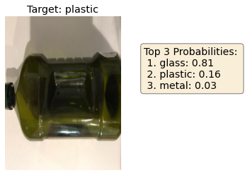
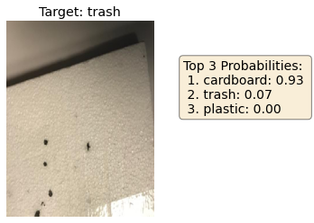
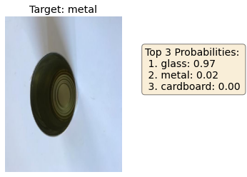

# Recycling with Machine Learning

## Building a Convolutional Neural Network for Image Classification

Presentation slides: https://github.com/acaldwell93/capstone_2/blob/main/DSI_capstone_2.pdf

### The Problem...

According to EPA estimates, approximately 75% of US waste material is recyclable, yet only 30% of it is recycled. The vast majority is simply thrown away, contributing to the exponentially growing global landfill crisis. Among the myriad effects of this crisis are growing greenhouse gas emissions, destruction of wildlife habitat, and pollution of groundwater.

Escalating environmental crises have certainly encouraged efforts to mitigate the problem. For example, recycling campaigns can have a positive effect on recycling rates, but they’ve clearly not managed to close the gap. But perhaps automating the process through machine learning might provide a solution.

### The Goals

The primary business objective is to construct an image classifying model that could be used and/or further developed in an automated garbage sorting process. Ultimately, the goal would be to integrate this technology in waste management systems to improve recycling rates and reduce our contribution to landfill growth.

Furthermore, we want to use this opportunity to explore convolutional neural networks, trying a variety of basic architectures, tuning the many hyperparameters and observing subsequent effects on the performance of our models.

### The Data

 - 2,467 images (512x384 RGB)
 - Orientation, location, and distance of object is highly irregular
 - Imbalanced classes

The variability in the object’s orientation and location makes a convolutional neural network the most practical choice, since all neurons in a feature map share the same parameters, allowing it to a feature anywhere in its input.

In order to deal with the very small sample size, as well as the high degree of variability, using the Keras ImageDataGenerator (with flip, shear, rotation, etc.) to supplement the data will be crucial. 

Furthermore, class weights should also be passed to the model to ensure the model learns equally from the relatively underrepresented classes

Download: https://www.kaggle.com/asdasdasasdas/garbage-classification

### Exploring Different Networks

A small sample of the CNNs I tested over course of the project

#### General architectures / Convolution-Pooling patterns
  Tested a network based on LeNet-5, as well as networks using convolution-pooling and convolution-convolution-pooling patterns
#### Number of Filters
  Typically found an increasing number of filters as you go deeper in the network, similar to the AlexNet structure, worked best for this use case
#### Kernel Size
  Found larger kernel sizes for the first couple of layers worked well, but did increase training time substantially
#### Batch Normalization
  Initially applied after every convolution, but the final model used only one layer of batch normalization in the beginning of the network as a kind of scaler
#### Dropout
  Employed a relatively small dropout rate (0.1) in the Dense layer for regularization
#### Learning rate
  Dropping the learning rate below the Adam Optimizer’s default 0.001 seemed to work best, particularly when using early stopping and a higher patience
 
### Assessing Performance

Using Keras’ early stopping callback to restore the best weights of our model as measured by validation loss, we see our model was stopped after 89 epochs, which also corresponded to our highest validation accuracy score of .808.

Testing this model on a holdout dataset, we wind up with a slightly more optimistic accuracy of .89. However, given the small original sample size, this holdout data set was quite small as well. I would be cautious about accepting this higher performance score as a certainty.

Accuracy is important, but what about other metrics? Here is a classification report detailing precision, recall, and f1-scores for each of the 6 classes.
Precision: True Positives / (True Positives + False Positives)
Recall: True Positives / (True Positives + False Negatives)
F1 score: harmonic mean of precision and sensitivity

### Visualizing Performance with Confusion Matrix and ROC curve

This matrix makes it a little easier to see where the model makes most of its mistakes. In particular, when the object is glass, the model often mistakes it for metal or plastic. The model also mistakes trash for cardboard and metal with relative frequency.

This multi-class ROC curve is another way of visualizing how well the model performs with respect to each individual class. It could be useful in tuning or selecting a different model should misidentifying a particular class need to be treated more significantly.

### What the model thinks it knows, but doesn’t know...

Taking a look at some of the incorrect predictions with the highest probabilities can give valuable insight into how the model will evolve with further training. These “very wrong” guesses will have the largest gradients, and thus, will be what the model most focuses on to minimize the cost function.
 
 
 
 
 
 
 
 

At a glance, this sample of guesses seems to confirm what our confusion matrix suggested. The model sometimes struggles with identifying the differences between plastic, glass, and metal. The top down view was also a fairly common theme among other, less certain incorrect predictions. The model’s also clearly not ‘discovered’ that styrofoam is trash, not cardboard.

### Exploration moving forward...

While the final model might not be ‘production ready’, its performance at the given level of complexity may serve as a proof of concept and warrant further exploration. It would be interesting to see how deeper, more complex models might perform if given enough time and computing power to train. 

It would also be nice to see how the model performs when trained on a larger data set. The small size meant the model would have to rely heavily on supplementation through the Keras ImageDataGenerator, and also made me more skeptical of relatively higher holdout accuracy rates. More data might help the model train more effectively and give more reliable final performance ratings.

And even without developing more complex models, I was only able to test so many hyperparameters. I would have liked to explore more with respect to optimizers, activation functions, and regularization techniques.

